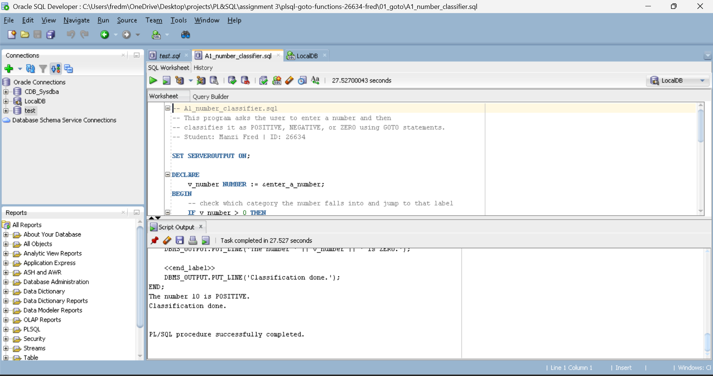
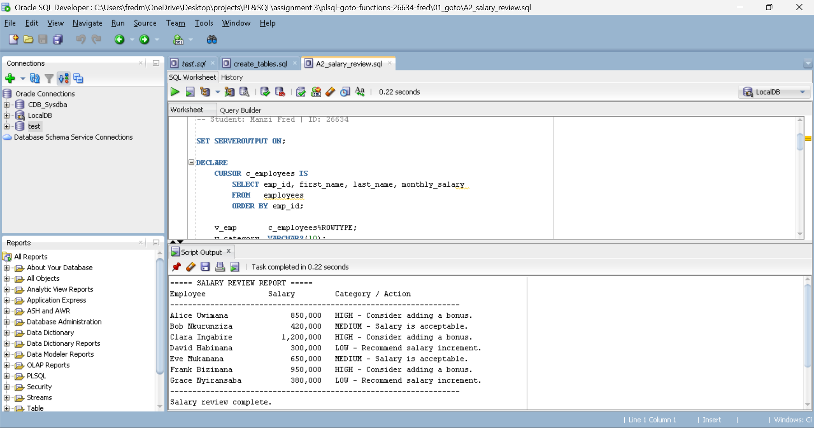
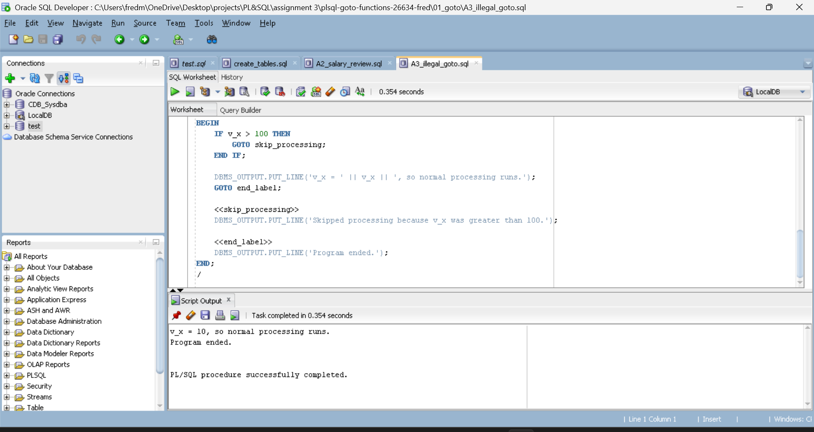
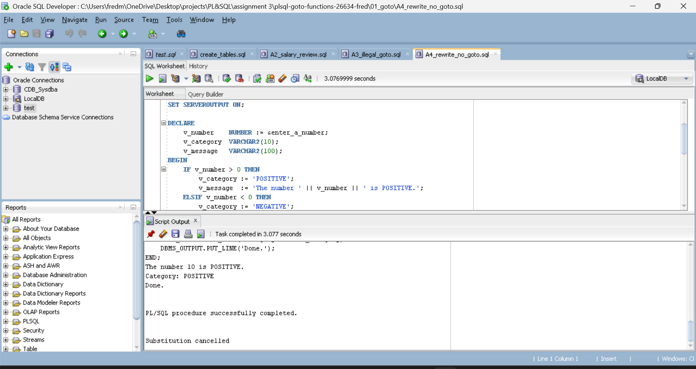
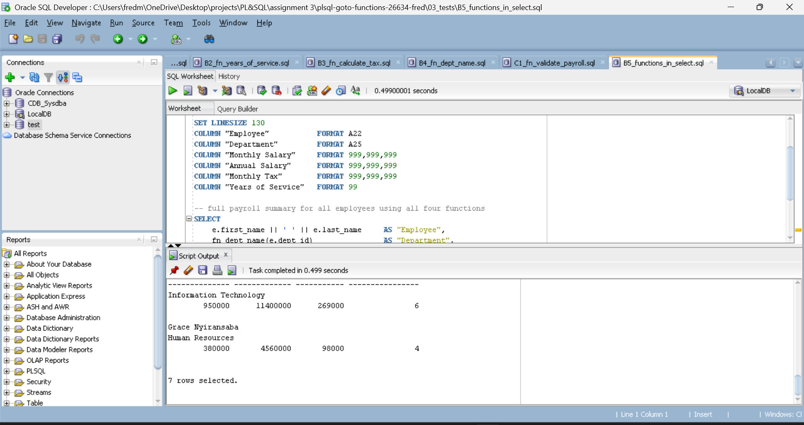
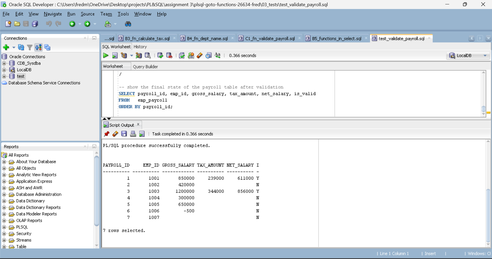

# PL/SQL GOTO Statements and Functions
**Student:** Manzi Fred | **ID:** 26634  
**Course:** INSY 8311 — Database Development with PL/SQL  
**Instructor:** Eric Maniraguha  
**Deadline:** Thursday, October 8, 2026

---

## Repository Structure

```
plsql-goto-functions-26634-fred/
├── README.md
├── .gitignore
├── 00_setup/
│   └── create_tables.sql
├── 01_goto/
│   ├── A1_number_classifier.sql
│   ├── A2_salary_review.sql
│   ├── A3_illegal_goto.sql
│   └── A4_rewrite_no_goto.sql
├── 02_functions/
│   ├── B1_fn_annual_salary.sql
│   ├── B2_fn_years_of_service.sql
│   ├── B3_fn_calculate_tax.sql
│   ├── B4_fn_dept_name.sql
│   └── C1_fn_validate_payroll.sql
├── 03_tests/
│   ├── B5_functions_in_select.sql
│   ├── test_functions.sql
│   └── test_validate_payroll.sql
├── screenshots/
│   ├── A1_output.png
│   ├── A2_output.png
│   ├── A3_error_and_fix.png
│   ├── A4_output.png
│   ├── B5_select_output.png
│   └── C1_output.png
└── docs/
    └── REFLECTION.md
```

---

## How to Run

Run files in this order in Oracle SQL Developer. Open each file with File → Open and press F5.

```
1. 00_setup/create_tables.sql
2. 02_functions/B1_fn_annual_salary.sql
3. 02_functions/B2_fn_years_of_service.sql
4. 02_functions/B3_fn_calculate_tax.sql
5. 02_functions/B4_fn_dept_name.sql
6. 02_functions/C1_fn_validate_payroll.sql
7. 01_goto/A1_number_classifier.sql
8. 01_goto/A2_salary_review.sql
9. 01_goto/A3_illegal_goto.sql
10. 01_goto/A4_rewrite_no_goto.sql
11. 03_tests/B5_functions_in_select.sql
12. 03_tests/test_functions.sql
13. 03_tests/test_validate_payroll.sql
```

A1 and A4 will prompt you to enter a number when running.

---

## Part A — GOTO Statements

### A1 — Number Classifier
Asks the user to enter a number and classifies it as POSITIVE, NEGATIVE, or ZERO using GOTO labels.

**Output:**
```
The number 10 is POSITIVE.
Classification done.
PL/SQL procedure successfully completed.
```


---

### A2 — Salary Review
Loops through all employees and uses GOTO to branch into salary categories based on monthly salary bands.

- LOW: below 400,000 → recommend increment
- MEDIUM: 400,000 to 799,999 → salary acceptable
- HIGH: 800,000 and above → consider bonus

**Output:**
```
===== SALARY REVIEW REPORT =====
Employee               Salary          Category / Action
-----------------------------------------------------------------
Alice Uwimana            850,000       HIGH - Consider adding a bonus.
Bob Nkurunziza           420,000       MEDIUM - Salary is acceptable.
Clara Ingabire         1,200,000       HIGH - Consider adding a bonus.
David Habimana           300,000       LOW - Recommend salary increment.
Eve Mukamana             650,000       MEDIUM - Salary is acceptable.
Frank Bizimana           950,000       HIGH - Consider adding a bonus.
Grace Nyiransaba         380,000       LOW - Recommend salary increment.
Salary review complete.
```


---

### A3 — Illegal GOTO and Fix
Shows an example of an illegal GOTO (jumping into an IF block), explains the PLS-00375 error, and provides the corrected version where the label is placed at the same block level as the GOTO.

**Output (fixed version):**
```
v_x = 10, so normal processing runs.
Program ended.
PL/SQL procedure successfully completed.
```


---

### A4 — Rewrite Without GOTO
The same number classification logic from A1 rewritten using IF-ELSIF-ELSE. No GOTO statements are used. The code produces the same result but is easier to read and maintain.

**Output:**
```
The number 10 is POSITIVE.
Category: POSITIVE
Done.
PL/SQL procedure successfully completed.
```


---

## Part B — Stored Functions

### B1 — fn_annual_salary
Returns annual salary by multiplying monthly salary by 12. Raises an error if input is NULL or negative.

**Output:**
```
Function FN_ANNUAL_SALARY compiled
Annual salary for 500,000/month:    6,000,000
Annual salary for 1,200,000/month: 14,400,000
PL/SQL procedure successfully completed.
```


---

### B2 — fn_years_of_service
Returns the number of full years an employee has worked using MONTHS_BETWEEN divided by 12. Raises an error for NULL or future dates.

**Output:**
```
Function FN_YEARS_OF_SERVICE compiled
Years of service (hired 2018-03-15): 8
Years of service (hired 2023-01-10): 3
PL/SQL procedure successfully completed.
```


---

### B3 — fn_calculate_tax
Calculates monthly income tax using Rwanda PAYE progressive brackets. Each portion of the salary is taxed at the rate for its bracket only.

---

### B4 — fn_dept_name
Returns the department name for a given dept_id. If the department does not exist it returns 'Unknown Department' instead of raising an error.

**Output:**
```
Function FN_DEPT_NAME compiled
Dept 10 : Human Resources
Dept 20 : Information Technology
Dept 99 : Unknown Department
PL/SQL procedure successfully completed.
```


---

### B5 — Functions in SQL SELECT
All four functions are called directly inside a SQL SELECT query to show they work from SQL, not just PL/SQL blocks.

**Output:** 7 rows showing each employee with their department, annual salary, monthly tax, and years of service.



---

## Part C — Combined Task

### C1 — fn_validate_payroll
Validates each payroll record against three rules:
1. gross_salary must not be NULL
2. gross_salary must be greater than zero
3. emp_id must exist in the employees table

If valid, it calls fn_calculate_tax, calculates net salary, updates the emp_payroll table, and marks is_valid = 'Y'. Invalid records are marked 'N'.

**Test results:**
```
Test 1 - valid record (Alice):   VALID | Gross: 850,000 | Tax: 239,000 | Net: 611,000
Test 2 - valid record (Clara):   VALID | Gross: 1,200,000 | Tax: 344,000 | Net: 856,000
Test 3 - negative salary:        INVALID: salary must be greater than zero
Test 4 - NULL salary:            INVALID: has a NULL gross salary
Test 5 - record does not exist:  ERROR: Payroll ID 999 not found
```



---

## Notes
- A1 and A4 use `&enter_a_number` which prompts for input at runtime
- All functions handle NULL and invalid inputs with exceptions
- The functions must be created before running the test files
